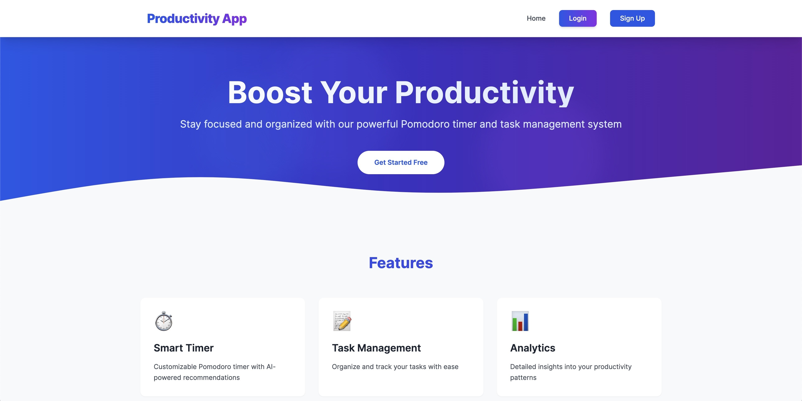

# Productivity App

## Overview

A full-stack productivity application for tracking work sessions and managing tasks. Users can create timed work sessions, manage tasks, and monitor their productivity.


_Homepage_

## Features

- User authentication (signup/login)
- Session tracking
- Task management
- Dashboard analytics
- Real-time session timer

## Tech Stack

### Backend

- Ruby on Rails 7.2
- PostgreSQL
- JWT Authentication
- Jbuilder
- Rack-CORS

### Frontend

- React.js
- React Router
- Axios
- Context API

### Installation

```bash
# Clone repository
git clone [repository-url]

# Navigate to project directory
cd Productivity-App-Backend

# Install dependencies
bundle install

# Setup database
rails db:create
rails db:migrate
rails db:seed

# Start server
rails server

```

To setup the Frontend: [click here](https://github.com/devdugz/Productivity-App-Frontend#readme)

### API Endpoints

- Authentication

  - POST /users.json - Create account
  - POST /login_sessions.json - Login
  - DELETE /logout.json - Logout

- Tasks

  - GET /tasks.json - List tasks
  - POST /tasks.json - Create task
  - PATCH /tasks/:id.json - Update task
  - DELETE /tasks/:id.json - Delete task

- Sessions
  - GET /sessions.json - List sessions
  - POST /sessions.json - Create session

## License

This project is licensed under the MIT License - see the LICENSE file for details.
